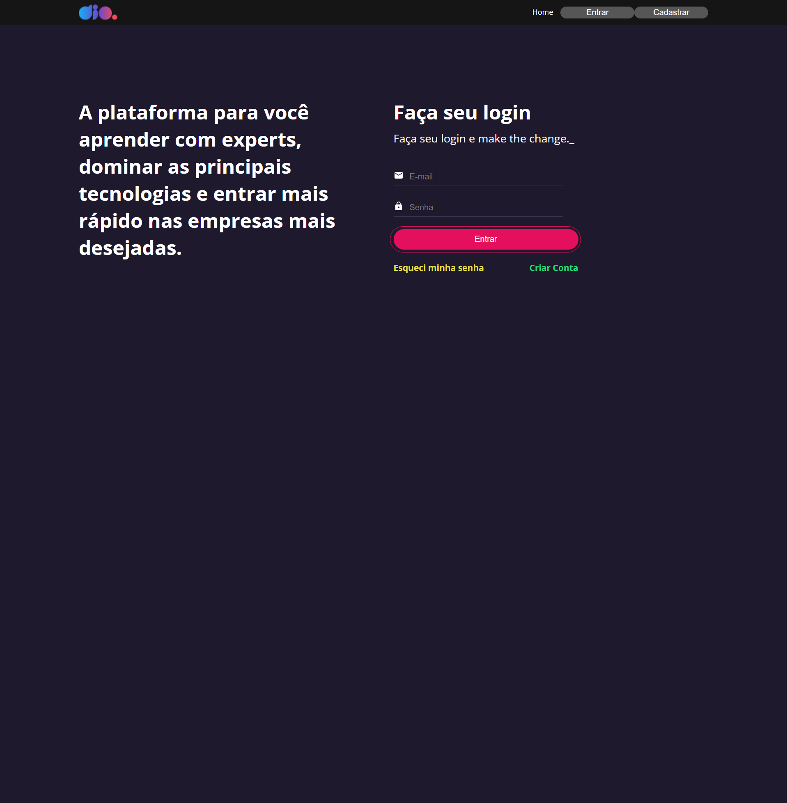
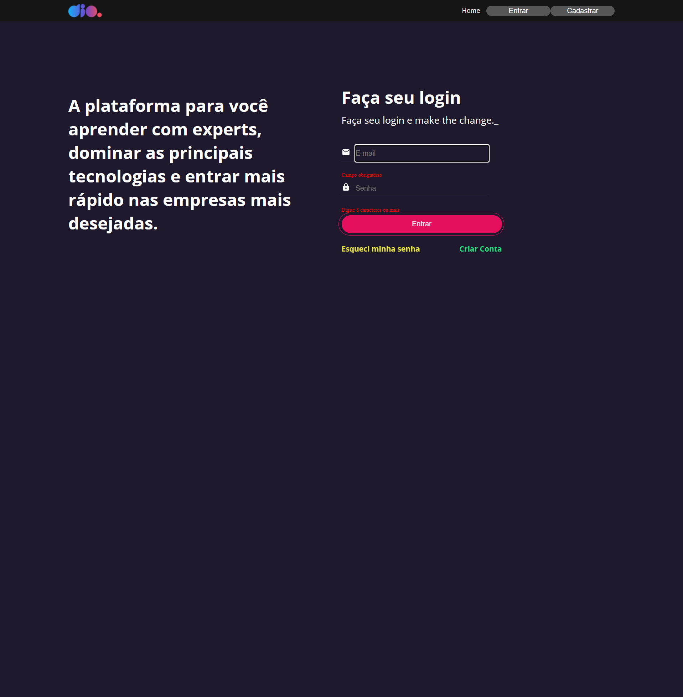
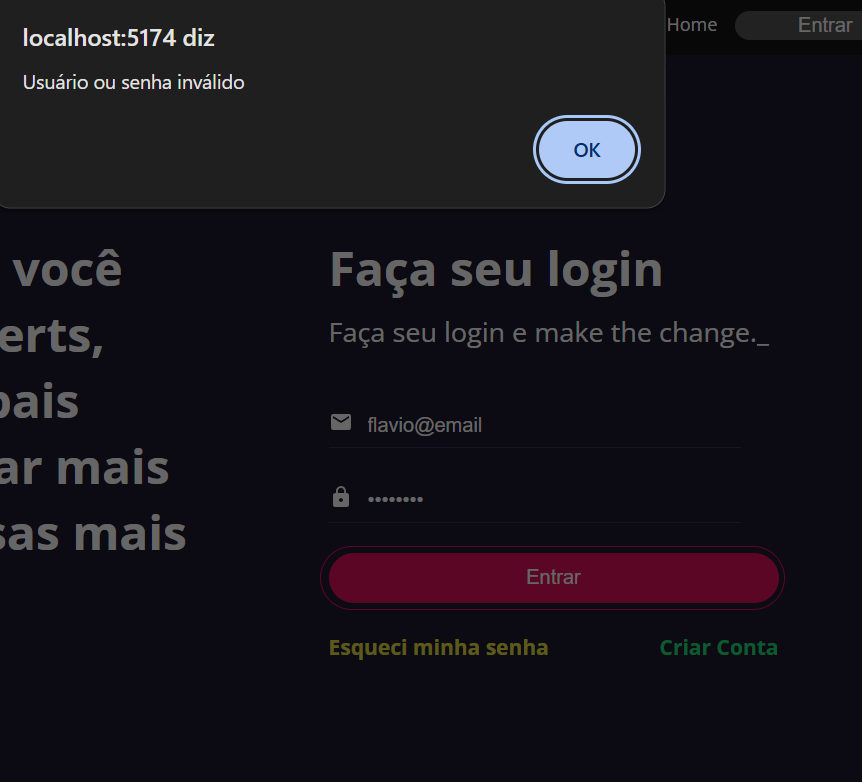
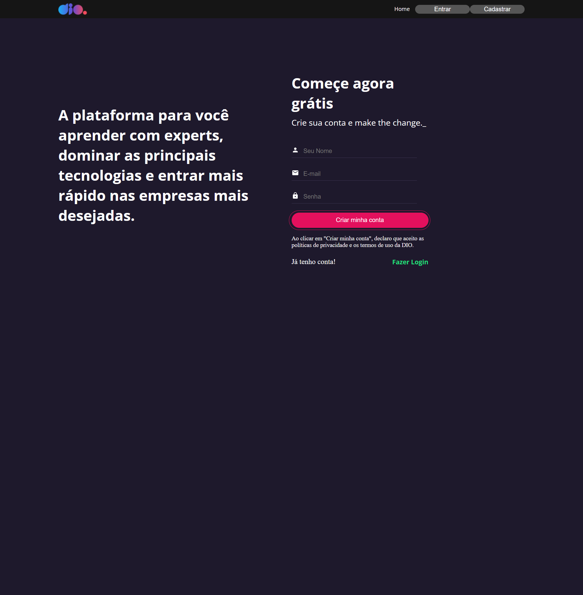
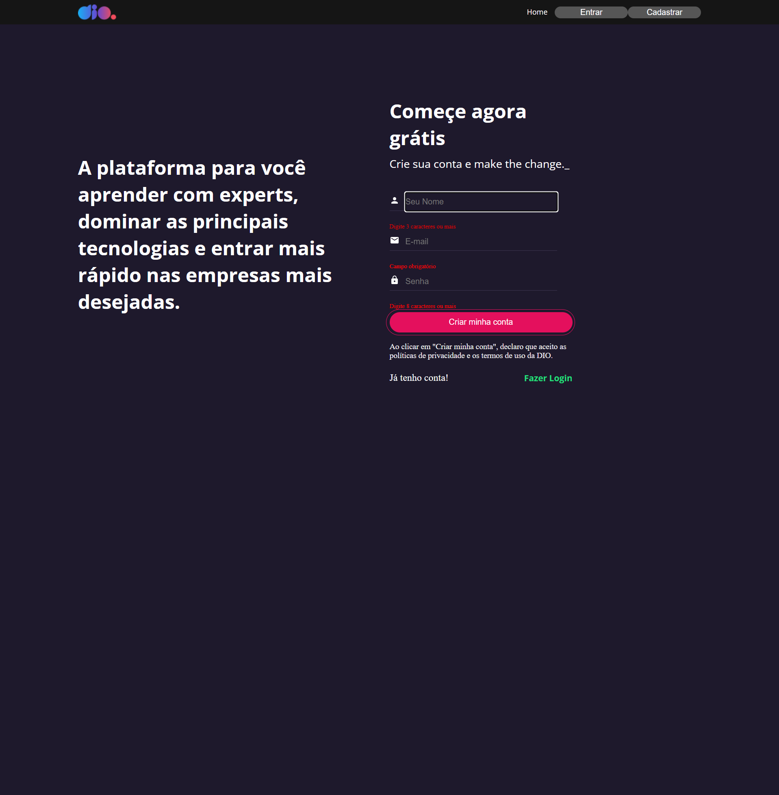
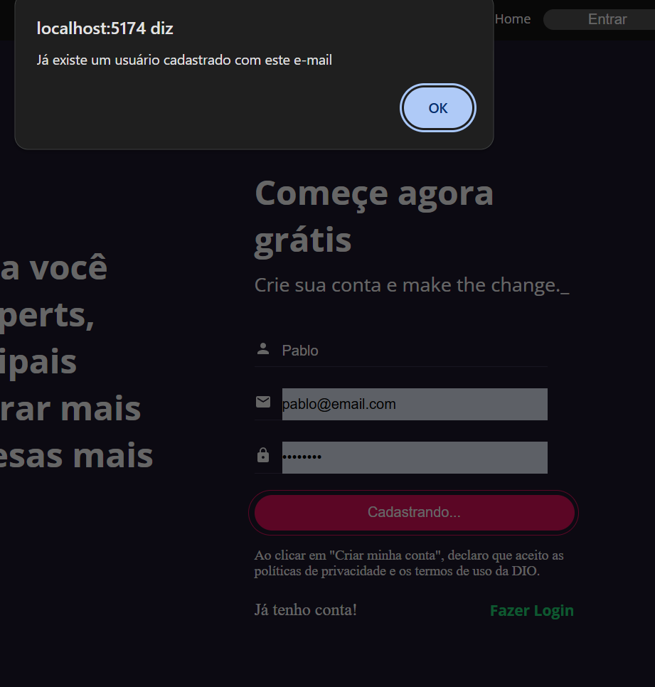
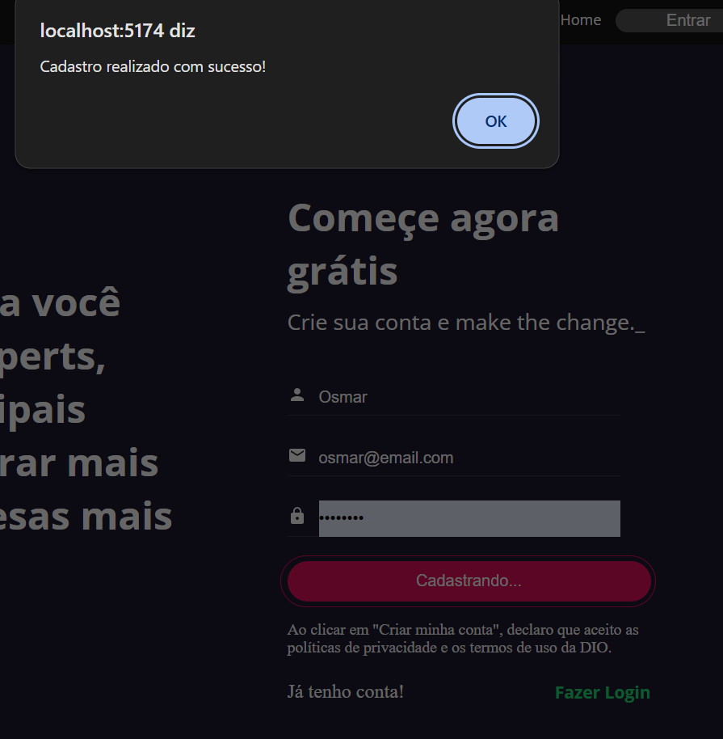
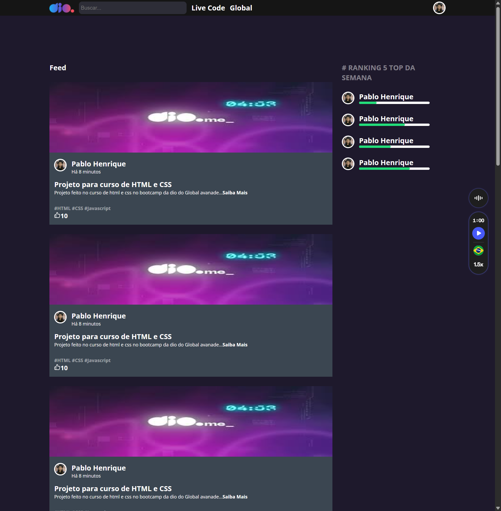

# DIO Page Clone em React

O projeto consiste em uma réplica, simplificada e desenvolvida em React, da landing page da DIO, contendo 4 paginas de navegação (home, login e sing-up e feed) acessadas via do React Router. Foram implementadas validações de formulário utilizando react forms e yup, tanto para login quanto para cadastro e uma API simulada com JSON Server para persistência das informações. A comunicação com a API é realizada através do Axios. 

O sistema valida login e cadastro verificando a existência prévia de usuários e prevenindo duplicações. Após um cadastro bem-sucedido, o banco de dados é atualizado, permitindo o login do novo usuário.

## Previews

### Home

### Login

#### Validações

### Cadastro

#### Validações

### Feed
